<table cellspacing="0" cellpadding="0" style="border: none;">
  <tr style="border: none;">
    <td style="vertical-align: top; border: none;" valign="top">
      
       
      
    </td>
    <td>
      
    </td>
  </tr>
</table>

  

